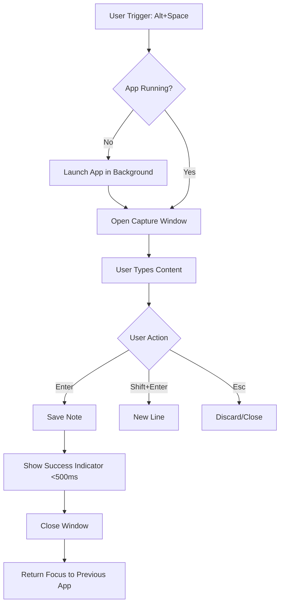
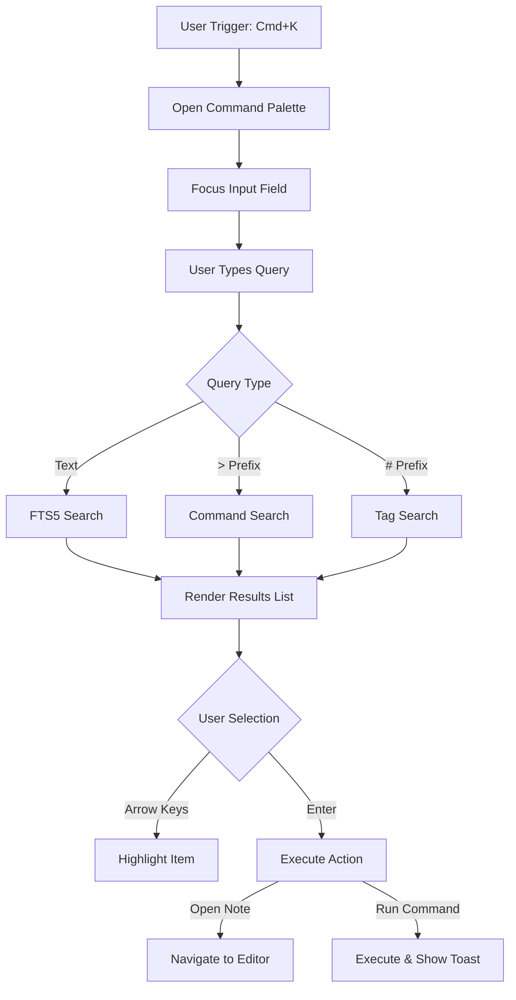

---
stepsCompleted:
  - step-01-init
  - step-02-discovery
  - step-03-core-experience
  - step-04-emotional-response
  - step-05-inspiration
  - step-06-design-system
  - step-07-defining-experience
  - step-08-visual-foundation
  - step-09-design-directions
  - step-10-user-journeys
  - step-11-component-strategy
  - step-12-ux-patterns
  - step-13-responsive-accessibility
  - step-14-complete
inputDocuments:
  - d:\Web Projects\secondbrain\docs\technical-specifications.md
  - d:\Web Projects\secondbrain\_bmad-output\project_knowledge\architecture.md
  - d:\Web Projects\secondbrain\_bmad-output\planning-artifacts\epics.md
---

# UX Design Specification: secondbrain

## 1. Executive Summary

### Project Vision
**"Functional Precision"**: A high-performance, precision-engineered Second Brain. It prioritizes clarity and speed (**Swiss Minimalist**) while utilizing utilitarian, structural elements (**Neo-Brutalist**) to convey information density and control. It is a tool for thought, not a decoration.

### Design System: "Rational Grid"
*   **80% Minimalist**:
    *   **Typography**: Clean Sans-Serif (Inter) for all long-form reading and writing.
    *   **Layout**: Ample whitespace, high contrast (Black/White), no decorative shadows or blurs.
    *   **Philosophy**: Content comes first. The interface disappears during Deep Work.
*   **20% Technical/Brutalist**:
    *   **Accents**: Monospaced fonts (JetBrains Mono) for metadata, IDs, tags, and stats.
    *   **Borders**: Visible, sharp 1px borders to define structure (The "Blueprint" look).
    *   **Interactions**: Snappy, instant state changes. No floating/drifting animations.

### Target Users
**"The Knowledge Architect"**: Users who treat knowledge management as an engineering discipline. They value structure, speed, and data ownership over "gamification" or "cozy" aesthetics.

### Key Design Challenges
1.  **Density vs. Clarity**: leveraging the Brutalist aspects to handle complex data (Graph/Metadata) without cluttering the Minimalist reading experience.
2.  **Role Distinction**: Using structural changes (layout/density) rather than cosmetic themes (colors/glass) to distinguish "Manager" vs. "Learner" modes.

## 2. Core User Experience

### 2.1 Defining Experience

**"The Neural Loop"**: The critical loop defining the product is **Capture -> Forget -> Retrieve**.
*   **Capture**: Must be instant (Global Shortcut), effectively "offloading" the thought so the user can forget it. It's about mental hygiene as much as data entry.
*   **Retrieve**: Must be faster than thinking (FTS5 Search), bringing the thought back exactly when needed.

### 2.2 User Mental Model

*   **Engineering Discipline**: Users approach knowledge management like code or engineering. They expect structure, determinism, and speed.
*   **"My Data, My Disk"**: Users visualize their notes as tangible files on their local drive, not cloud abstractions.
*   **Extension of Mind**: The tool is seen as a prosthetic for memory. If the tool is slow, their thinking feels slow.

### 2.3 Success Criteria

*   **Speed**: "Speed is a Feature". Any interaction taking >100ms is a bug.
*   **Reliability**: "If I put it here, it is safe." Zero data loss anxiety.
*   **Competence**: The user feels "Good at their job" because the tool amplifies their capability. Every shortcut must have an immediate visual acknowledgment (<50ms).

### 2.4 Novel UX Patterns

*   **Ambient AI**: The Contextual Sidebar quietly surfacing relevant notes without being asked is a novel pattern for local-first apps. It shifts retrieval from active search to passive discovery.
*   **Role Switching**: Explicitly changing the interface density and widget set based on "Manager" vs "Learner" modes is a unique take on workspace customization, going beyond simple themes.

### 2.5 Experience Mechanics

**1. Initiation:**
*   **Global Capture**: `Alt+Space` opens a minimal capture window anywhere in the OS.
*   **Retrieval**: `Cmd/Ctrl+K` opens the Command Palette instantly.

**2. Interaction:**
*   **Keyboard-First**: Navigation, Search, and Action are achievable without leaving the home row. Mouse is secondary.
*   **Wiki-Linking**: Typing `[[` instantly suggests notes.

**3. Feedback:**
*   **Instant**: Search results stream (no "loading" state). UI remains responsive during AI synthesis.
*   **Trust**: Exposed structure (file paths/IDs) confirms data reality.

**4. Completion:**
*   **Capture**: Note saved instantly, window closes. Emotional payoff: Relief.
*   **Retrieve**: Note opens immediately. Emotional payoff: Competence.

---

## 3. Desired Emotional Response

### Primary Emotional Goal
**"Flow State"**: The user should feel completely unencumbered. The tool should feel like an extension of their mind, not a hurdle to jump over. The primary emotion is **Focused Calm**.

### Micro-Emotions
*   **Competence (vs. Frustration)**: Every interaction (search, link, edit) works exactly as expected. The user feels "Good at their job" because the tool amplifies their capability.
*   **Trust (vs. Anxiety)**: "If I put it here, it is safe." The Brutalist/Technical elements reinforce that this is a robust, serious engineering tool, not a toy.
*   **Relief (vs. Overwhelm)**: The "Capture" mechanic provides immediate relief from the mental load of holding onto a thought.

### Design Implications
*   **Flow State** → **Minimalism**: Remove all decorative noise (shadows, gradients) that competes for attention.
*   **Competence** → **Instant Feedback**: Every shortcut must have an immediate visual acknowledgment (<50ms).
*   **Trust** → **Exposed Structure**: Show the file paths or IDs (Brutalist) to confirm "This is real data on my disk."

### Emotional Design Principles
1.  **Invisible until Needed**: The UI gets out of the way.
2.  **Earned Complexity**: Only show advanced controls (Graph, Metadata) when the user explicitly asks for them.
3.  **Reliability is Beautiful**: A plain text file that opens in 10ms is more beautiful than a loading spinner with a gradient.

---

## 4. Visual Design Foundation

### Color System

The color strategy follows an **"Extreme Contrast"** model to minimize cognitive load and maximize structural clarity.

*   **Primary Palette**: Absolute White (`#FFFFFF`) and Absolute Black (`#000000`).
*   **Semantic Accents**:
    *   **Action Blue (`#0066FF`)**: Used sparingly for primary buttons, active states, and focus indicators.
    *   **Technical Gray (`#6B7280`)**: Used for secondary metadata and monospaced elements to create visual hierarchy without adding "color."
*   **Status Indicators**: Utilitarian Green (`#10B981`) and Amber (`#F59E0B`) for system feedback.
*   **Accessibility**: 100% compliant with WCAG AAA for contrast. No use of "soft" grays for critical text.

### Typography System

We use a **Functional Pair** that distinguishes between "Human Reading" and "Machine Data."

*   **Primary Typeface (Reading/UI)**: **Inter** (Sans-Serif).
    *   **Tone**: Neutral, highly legible.
    *   **Weights**: Regular (400) for body, Semi-Bold (600) for UI labels, Bold (700) for structural headers.
*   **Secondary Typeface (Technical/Metadata)**: **JetBrains Mono** (Monospace).
    *   **Tone**: Utilitarian, precise.
    *   **Usage**: Tags, timestamps, file paths, IDs, and code blocks.
*   **Type Scale**:
    *   H1: 24px Bold (Inter)
    *   H2: 20px Bold (Inter)
    *   Body: 16px Regular (Inter)
    *   Metadata: 14px Regular (JetBrains Mono)

### Spacing & Layout Foundation

The layout is built on a **"Rational Grid"** of 8px increments.

*   **Base Unit**: 8px (Grid-8).
*   **Structural Borders**: Fixed 1px solid lines. **Zero border-radius**. Sharp corners emphasize the "Neo-Brutalist" blueprint feel.
*   **Information Density**:
    *   **Editor**: "Airy" (32px+ margins) to promote deep work and flow.
    *   **Sidebar/Dashboard**: "Compact" (8px-16px padding) to maximize information density for management tasks.
*   **Grid System**: A flexible CSS Grid/Flexbox approach that aligns every element to the 8px baseline.

### Accessibility Considerations

*   **Keyboard Focus**: High-visibility 2px blue borders for all keyboard-focused elements.
*   **Screen Readers**: Semantic HTML used throughout; all icons have aria-labels.
*   **Motion**: Zero decorative animations. Functional transitions (fades/slides) are kept under 150ms to ensure the UI feels "instant."

---

## 5. Key User Flows

### Flow 1: Rapid Capture
1. User presses `Alt+Space` (Global Shortcut)
2. Minimal capture window appears (title + body)
3. User types, presses `Enter`
4. Note saved instantly, window closes
5. **Emotional Payoff**: Relief (thought offloaded)

### Flow 2: Instant Retrieval
1. User presses `Cmd/Ctrl+K` (Command Palette)
2. Palette opens <100ms
3. User types 2-3 words
4. FTS5 results appear in real-time
5. User presses `Enter`, note opens
6. **Emotional Payoff**: Competence (found it immediately)

### Flow 3: Role Switching
1. User clicks Role Dropdown (Sidebar)
2. Selects "Learner" or "Manager"
3. UI density shifts (layout change, not color)
4. Dashboard widgets swap
5. **Emotional Payoff**: Control (interface adapts to me)

---

## 6. Implementation Guidelines

### Performance Requirements
*   All interactions must complete in <100ms
*   Search results must stream (no "loading" state)
*   UI must remain responsive during AI synthesis

### Accessibility
*   Keyboard navigation for 100% of features
*   High contrast mode support (WCAG AAA)
*   Screen reader compatibility for all interactive elements

### Responsive Behavior
*   Desktop-first (primary platform)
*   Minimum window width: 1024px
*   No mobile version in MVP

---

## 7. Component Specifications

### Dashboard Widgets

**Layout Grid**:
*   3-column grid on wide screens (>1440px)
*   2-column grid on standard screens (1024-1440px)
*   Each widget: 1px border, 16px padding, no shadow

**Widget Types**:

1. **Activity Heatmap** (Calendar Grid)
   *   7x5 grid (weeks × days)
   *   Cell size: 32px × 32px
   *   States: Empty (border only), Low (25% fill), Medium (50%), High (100%)
   *   Hover: Show note title + timestamp in monospace
   *   Click: Open note directly

2. **Quick Stats** (Metrics Cards)
   *   Layout: Icon + Number + Label (vertical stack)
   *   Typography: 32px number (Inter Bold), 14px label (Inter Regular)
   *   Icons: 24px, monochrome (no color)
   *   Border: 1px solid, no background fill

3. **Recent Notes** (List)
   *   Max 5 items
   *   Each item: Title (16px) + Timestamp (14px monospace gray)
   *   Hover: Entire row gets 1px left border accent
   *   No thumbnails or previews

**Role-Based Widget Swapping**:
*   **Manager Mode**: "Tasks Pending", "Project Deadlines", "Team Activity"
*   **Learner Mode**: "Spaced Repetition Queue", "Reading List", "Study Streaks"
*   Transition: Instant swap (no animation), widgets fade in/out over 150ms

### Graph View

**Canvas**:
*   Full viewport (no max-width constraint)
*   Background: Solid color (no grid pattern)
*   Zoom: Mouse wheel (10% increments), no zoom UI controls

**Node Styling**:
*   **Shape**: Circle, 12px diameter (default)
*   **Size Scaling**: Based on backlink count (12px - 24px)
*   **Fill**: Solid color (no gradients)
*   **Label**: Note title, 12px Inter, appears on hover only
*   **States**:
    *   Default: Border only (1px)
    *   Hover: Solid fill + label
    *   Selected: 2px border + solid fill
    *   Connected (1-hop): 50% opacity
    *   Unconnected: 25% opacity

**Edge Styling**:
*   **Line**: 1px solid, straight (no curves)
*   **Color**: Same as border color (context-aware)
*   **States**:
    *   Default: 25% opacity
    *   Hover (node): 100% opacity for connected edges
    *   Bidirectional: Double line (2px apart)

**Interactions**:
*   **Click Node**: Open note in editor (replace current view)
*   **Drag Node**: Reposition (physics simulation pauses)
*   **Double-Click Canvas**: Reset zoom/pan
*   **Right-Click Node**: Context menu (Open in New Tab, Show Backlinks)

**Performance**:
*   Render up to 1000 nodes without lag (60fps)
*   Use canvas rendering (not SVG) for large graphs
*   Lazy-load node labels (only render visible viewport)

---

## 8. Design Direction Decision

### Design Directions Explored

We explored six visual directions ranging from the high-density **"Blueprint"** (Brutalist-heavy) to the ethereal **"Flow State"** (Minimalist-heavy), as well as specialized layouts like the **"Command Console"** and **"Neural Graph."**

### Chosen Direction

**The "Rational Grid" (Hybrid)**: A synthesis of **Direction 1 (Blueprint)** and **Direction 2 (Flow State)**. 
*   **The Editor** adopts the "Flow State" philosophy—removing all visual noise to prioritize the writing experience.
*   **The Sidebar and Dashboard** adopt the "Blueprint" philosophy—using sharp 1px borders and monospaced metadata to convey information density and technical control.

### Design Rationale

This hybrid approach respects the dual nature of the "Knowledge Architect":
1.  **Creation** requires a distraction-free, minimalist environment.
2.  **Organization** requires clear structure and structural metadata to manage complexity. 
The use of **Action Blue (#0066FF)** against a high-contrast monochrome foundation ensures that functional elements are discoverable without being decorative.

### Implementation Approach

*   **Foundation**: Tailwind CSS with a strict 8px grid.
*   **Borders**: Solid 1px black/gray borders with `border-radius: 0`.
*   **Typography**: Inter (UI/Reading) paired with JetBrains Mono (Metadata/Stats).
*   **State**: Use Framer Motion for functional transitions (under 150ms) while avoiding decorative animations.

---

## 9. User Journey Flows

### 9.1 Rapid Capture (The Thought Offload)
**Goal:** Capture an idea and return to previous context in <2 seconds.



### 9.2 Instant Retrieval (The Recall)
**Goal:** Navigate to a specific note or command in <200ms.



### 9.3 Synthesis & Connection
**Goal:** Discover relationships and create new knowledge.

```mermaid
graph TD
    A[User in Editor] --> B[Type "[["]
    B --> C[Show Link Suggestions]
    C --> D[User Selects Note]
    D --> E[Insert Wiki-Link]
    
    E --> F[Update Graph Data]
    F --> G[Contextual Sidebar Updates]
    
    G --> H{User Action}
    H -- Click Sidebar Item --> I[Open Related Note]
    H -- Open Graph View --> J[Visualize Connections]
```

### Journey Patterns
*   **Keyboard-Centricity**: All flows start and end with keyboard triggers. Mouse is optional.
*   **Optimistic UI**: Success states (saving, linking) are shown immediately, assuming backend success.
*   **Context Preservation**: Windows/modals close automatically to return the user to their previous context ("Flow State").

### Flow Optimization Principles
1.  **Zero-Latency Perception**: All heavy operations (Search, AI) happen asynchronously; the UI never freezes.
2.  **Escape Hatches**: `Esc` always closes the current modal or clears the current selection.
3.  **Progressive Disclosure**: Advanced options (metadata, detailed stats) are hidden until requested.

---

## 10. Component Strategy

### 10.1 Capture Modal
**Purpose**: The primary entry point for quick thoughts. Minimalist, focused, ephemeral.
**Anatomy**:
*   No window chrome (frameless).
*   Single textarea with auto-resize.
*   Bottom bar: "Enter to Save" hint (mono).
**States**:
*   **Empty**: Placeholder "Capture a thought..."
*   **Typing**: Blue border accent.
*   **Success**: Briefly flashes green before closing.

### 10.2 Command Palette
**Purpose**: The "Operating System" for the app. Combines search and actions.
**Anatomy**:
*   Input field (top).
*   Results list (virtualized).
*   Action hint (right side of selected item).
**States**:
*   **Initial**: Shows "Recent Notes".
*   **No Results**: "No matching notes. Press Enter to create."
*   **Command Mode**: Triggered by `>`, filters for actions like "Toggle Dark Mode."

### 10.3 Context Sidebar (Ambient AI)
**Purpose**: Passive discovery engine. Lives on the right, often collapsed.
**Anatomy**:
*   Header: "Related Notes" (collapsible).
*   List Items: Title + 2-line summary.
*   Similarity Score: Represented by opacity or a small mono badge (e.g., "98%").
**States**:
*   **Idle**: Grayed out or hidden.
*   **Processing**: Subtle pulse animation (no spinners).
*   **Results**: List populates smoothly.

### 10.4 Editor Block
**Purpose**: The atomic unit of content.
**Anatomy**:
*   Gutter: Holds block handle (drag/drop) and block ID (on hover).
*   Content Area: The text itself.
**States**:
*   **Default**: Clean text, no adornments.
*   **Hover**: Gutter handle appears (low opacity).
*   **Active**: Block background highlights slightly (very subtle gray).

### Implementation Roadmap

**Phase 1: The Core Loop (MVP)**
1.  **Editor Block**: Essential for writing.
2.  **Command Palette**: Essential for navigation.
3.  **Capture Modal**: Essential for the "Capture" part of the loop.

**Phase 2: The Second Brain**
1.  **Context Sidebar**: Adds the AI layer.
2.  **Graph View**: Adds the visual layer.

**Phase 3: The Polish**
1.  **Dashboard Widgets**: Adds the "Manager" role features.
2.  **Custom Settings Panels**: Detailed configuration.

---

## 11. UX Consistency Patterns

### Button Hierarchy

*   **Primary (Action Blue)**: Solid blue (`#0066FF`), white text. Use ONCE per view.
    *   *Usage*: "Create Note", "Save", "Confirm".
*   **Secondary (Outlined)**: 1px border (`#000`), white bg, black text.
    *   *Usage*: "Cancel", "Back", "Export".
*   **Tertiary (Ghost)**: No border, black text. Hover underline.
    *   *Usage*: "Settings", "Help", inline actions.
*   **Destructive**: 1px Red border, Red text.
    *   *Usage*: "Delete Note", "Clear Database".

### Feedback Patterns

*   **Micro-Status**: Text color changes briefly (e.g., "Saved" turns Green then fades back to Gray). No popups.
*   **Toasts**: Only for asynchronous background errors (e.g., "Export Failed").
*   **Optimistic Updates**: UI updates instantly; backend syncs in background. Revert UI only on error.

### Form Patterns

*   **Labeling**: Labels are `mono` font, uppercase, small (12px).
*   **Inputs**: 1px solid border. Active state is 2px Blue border.
*   **Validation**: Error messages appear inline below input in Red `mono` font.

### Navigation Patterns

*   **Primary**: Command Palette (`Cmd+K`).
*   **Secondary**: Sidebar (File Tree).
*   **Tertiary**: Wiki-Links (In-content).
*   **Back/Forward**: Standard browser behavior (`Alt+Left/Right`).

### Empty States

*   **Dashboard**: "Your second brain is empty. Capture your first thought (Alt+Space)."
*   **Search**: "No results for 'xyz'. Press Enter to create note."
*   **Graph**: "Connect notes to see your galaxy form."

---

## 12. Responsive Design & Accessibility

### Responsive Strategy

**Desktop Sovereign (Desktop-First)**
*   **Wide (1440px+)**: 3-Column Layout (Sidebar + Editor + Context/Graph).
*   **Standard (1024px-1440px)**: 2-Column (Sidebar + Editor). Context Sidebar is collapsible overlay.
*   **Split View**: Editor maintains `max-width: 720px` centered for readability.
*   **Mobile**: Out of scope for MVP, but Tailwind Grid ensures future compatibility.

### Breakpoint Strategy

*   **lg (1024px)**: Sidebar becomes collapsible toggle.
*   **xl (1280px)**: Context Sidebar becomes visible.
*   **2xl (1536px)**: Dashboard switches to 3-column grid.

### Accessibility Strategy (WCAG AA+)

*   **Contrast**: "Rational Grid" uses Absolute Black/White, far exceeding 4.5:1.
*   **Focus Management**: Custom `ring-2 ring-blue-600` on all focusable elements. No default browser outline.
*   **Screen Readers**:
    *   `aria-label` on all icon buttons.
    *   Semantic `<main>`, `<nav>`, `<aside>` landmarks.
    *   `sr-only` class for visual-only decorations (like purely structural borders).

### Testing Strategy

*   **Keyboard Audit**: Can I perform the entire "Neural Loop" without touching the mouse?
*   **Zoom Test**: Does the layout break at 200% zoom?
*   **High Contrast Mode**: Verify Windows High Contrast mode support.

### Implementation Guidelines

*   **Units**: Use `rem` for typography and spacing.
*   **Media Queries**: Use Tailwind's `md:`, `lg:`, `xl:` prefixes.
*   **Reduced Motion**: `motion-reduce:transition-none` class for users who disable animations.