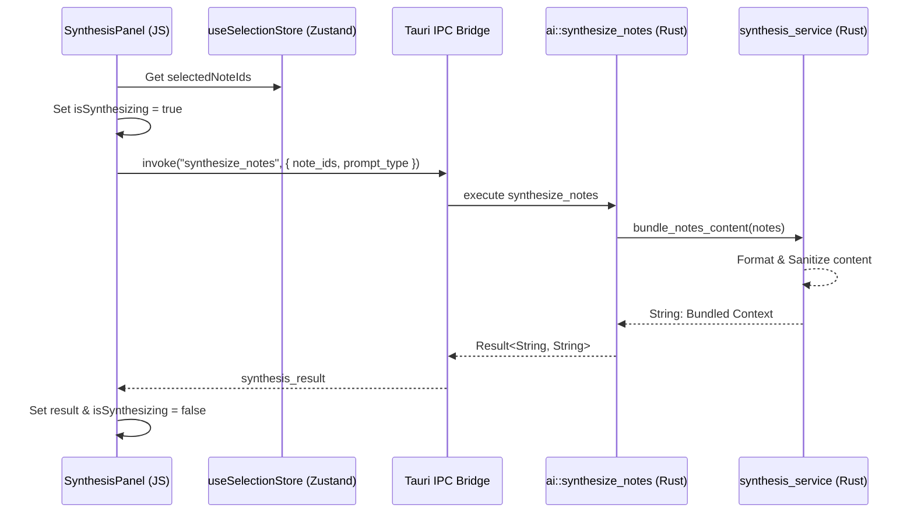

# Technical Explanation: AI Synthesis RAG Flow

This guide explains the complex interaction between the frontend UI and the native Rust backend during a multi-document synthesis request. KnowledgeBase Pro uses a **Retrieval-Augmented Generation (RAG)** inspired approach to ensure that AI insights are grounded in the user's specific local data.

## The Problem: Data Isolation and Token Limits
When a user wants to synthesize information from multiple notes:
1. The AI model needs the content of those notes as context.
2. Sending too much irrelevant data can exceed model token limits or lead to "hallucinations."
3. The UI must remain responsive while the backend bundles and processes this data.

## The Solution: Grounded Synthesis Pipeline



### 1. Frontend Selection & Trigger
The process begins in `src/shared/hooks/useSelectionStore.ts`, where the user's focus is tracked. When the `SynthesisPanel` is active, it extracts these IDs and triggers the `onSynthesize` callback.

### 2. The IPC Bridge (Tauri Commands)
The frontend uses `@tauri-apps/api` to invoke the `synthesize_notes` command. This is our secure gateway into the Rust environment.

### 3. Backend Content Bundling
The `synthesis_service.rs` performs the "Retrieval" and "Augmentation" logic:
- **Retrieval**: (Planned) Fetches note content from SQLite via FTS5.
- **Bundling**: Formats the notes into a structured prompt context:
  ```text
  Title: [Note A Title]
  Content: [Note A Body]
  ---
  Title: [Note B Title]
  ...
  ```
- **Augmentation**: Highlighting sources to allow the model to cite specific fragments.

### 4. Grounded Synthesis
The bundled content is then prepared for an LLM (currently mocked in the command). By strictly defining the context sent to the model, we ensure the synthesis is "grounded" in the selected notes.

## Key Implementation Files
- **Frontend**: `src/features/ai/components/SynthesisPanel.tsx`
- **IPC Command**: `src-tauri/src/commands/ai.rs`
- **Logic Service**: `src-tauri/src/services/synthesis_service.rs`

## Conclusion
This architecture ensures that AI operations are fast, private, and contextually accurate by leveraging local Rust performance for data preparation and high-fidelity React components for the user experience.

---
*Created by Paige (Technical Writer) on 2025-12-31*
